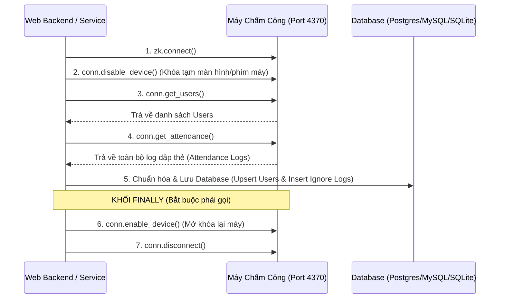

# TÀI LIỆU ĐẶC TẢ HỆ THỐNG CHẤM CÔNG (SPECIFICATION CHO DỰ ÁN WEB)

> **Mục đích tài liệu:** Tài liệu này đóng gói toàn bộ logic nghiệp vụ, quy tắc tính công, cấu trúc dữ liệu, thuật toán chuẩn hóa và cách thức giao tiếp với máy chấm công từ phần mềm máy tính (Desktop App) hiện tại.  
> Agent/Lập trình viên xây dựng hệ thống Web chỉ cần đọc tài liệu này là có thể tái hiện chính xác 100% logic của hệ thống.

---

## MỤC LỤC
1. [Kiến trúc kết nối Web với Máy chấm công](#1-kiến-trúc-kết-nối-web-với-máy-chấm-công)
2. [Giao thức & Quy trình kéo dữ liệu từ máy chấm công](#2-giao-thức--quy-trình-kéo-dữ-liệu-từ-máy-chấm-công)
3. [Cấu trúc Cơ sở dữ liệu & Data Models](#3-cấu-trúc-cơ-sở-dữ-liệu--data-models)
4. [Chuẩn hóa dữ liệu (Data Normalization)](#4-chuẩn-hóa-dữ-liệu-data-normalization)
5. [Quy tắc tính công & Đánh giá ca làm việc (Core Rules Engine)](#5-quy-tắc-tính-công--đánh-giá-ca-làm-việc-core-rules-engine)
6. [Logic tổng hợp công tháng & Ngày chuẩn](#6-logic-tổng-hợp-công-tháng--ngày-chuẩn)
7. [Module phụ trợ: Nhập & Xuất Excel](#7-module-phụ-trợ-nhập--xuất-excel)
8. [Đặc tả RESTful API đề xuất cho Web Backend](#8-đặc-tả-restful-api-đề-xuất-cho-web-backend)

---

## 1. KIẾN TRÚC KẾT NỐI WEB VỚI MÁY CHẤM CÔNG

### 1.1. Đặc thù kỹ thuật của máy chấm công (ZKTeco / Ronald Jack)
- Máy chấm công kết nối mạng LAN qua cổng socket **TCP/UDP 4370**.
- Trình duyệt Web (Browser) chạy trên Sandbox nên **không thể** mở kết nối TCP socket trực tiếp đến IP máy chấm công.

### 1.2. Mô hình kiến trúc triển khai trên Web
Có 2 phương án tùy thuộc vào vị trí đặt Server:
- **Phương án A (Server Web nằm trong cùng mạng LAN):** Web Backend (Node.js / Python FastAPI / Go / PHP...) kết nối trực tiếp đến IP máy chấm công (`192.168.1.xxx:4370`).
- **Phương án B (Server Web trên Cloud/VPS):** Cần 1 Agent/Daemon nhẹ (viết bằng Python hoặc Node.js) chạy trên 1 máy tính nội bộ trong công ty (hoặc Raspberry Pi). Daemon này định kỳ kéo dữ liệu từ máy chấm công rồi gửi qua REST API / WebSocket lên Web Server trên Cloud.

---

## 2. GIAO THỨC & QUY TRÌNH KÉO DỮ LIỆU TỪ MÁY CHẤM CÔNG

Thư viện chuẩn sử dụng:
- **Python Backend:** `pyzk` (`from zk import ZK`)
- **Node.js Backend:** `node-zklib`

### 2.1. Cấu hình kết nối mặc định
- **IP:** `192.168.1.201` (Cấu hình động tùy chỉnh)
- **Port:** `4370`
- **Password (Comm Key):** `123456` (hoặc `0` nếu máy không đặt mật khẩu)
- **Timeout:** `5` giây
- **Protocol:** TCP (nếu thất bại có thể fallback sang UDP)

### 2.2. Quy trình kéo dữ liệu (Workflow bắt buộc)
Để đảm bảo máy chấm công không bị đơ bàn phím hoặc treo kết nối:



> **LƯU Ý QUAN TRỌNG:** Phải luôn đặt `enable_device()` và `disconnect()` trong khối `finally`/`defer` để dù có lỗi xảy ra thì máy chấm công vẫn được mở khóa hoạt động bình thường, không bị treo.

---

## 3. CẤU TRÚC CƠ SỞ DỮ LIỆU & DATA MODELS

### 3.1. Bảng `config` (Lưu cấu hình hệ thống)
Lưu dạng Key-Value hoặc bảng Settings:

| Key | Kiểu | Mặc định | Ý nghĩa |
| :--- | :--- | :--- | :--- |
| `ip` | String | `192.168.1.201` | IP máy chấm công |
| `port` | Integer | `4370` | Cổng kết nối máy chấm công |
| `password` | Integer | `123456` | Mật mã kết nối máy |
| `timeout` | Integer | `5` | Thời gian chờ phản hồi (giây) |
| `shift_time_in` | String (HH:MM) | `08:00` | Giờ vào ca chuẩn sáng |
| `shift_time_out` | String (HH:MM) | `17:00` | Giờ tan ca chuẩn chiều |
| `work_required_hours` | Float | `8.0` | Số giờ làm việc yêu cầu trong ngày |
| `lunch_break_hours` | Float | `1.0` | Thời gian nghỉ trưa được trừ |
| `flex_latest_in` | String (HH:MM) | `09:00` | Giới hạn vào muộn linh hoạt được bù giờ |
| `weekly_off_days` | String | `5,6` | Ngày nghỉ tuần (0=T2, 1=T3, ..., 5=T7, 6=CN) |

### 3.2. Bảng `users` (Danh sách nhân viên)
| Cột | Kiểu | Ràng buộc | Mô tả |
| :--- | :--- | :--- | :--- |
| `user_id` | VARCHAR(50) | PRIMARY KEY | Mã nhân viên (ví dụ: "1", "2", "10") |
| `name` | VARCHAR(255) | | Họ và tên |
| `role` | VARCHAR(100) | Mặc định 'Nhân viên' | Chức vụ/Phòng ban ("Quản trị", "Nhân viên") |
| `card` | VARCHAR(50) | Mặc định '---' | Mã thẻ từ (nếu có) |
| `group_id` | VARCHAR(50) | Mặc định '0' | Nhóm người dùng trên máy |
| `updated_at`| TIMESTAMP | CURRENT_TIMESTAMP | Thời điểm cập nhật cuối |

### 3.3. Bảng `attendance` (Nhật ký quẹt thẻ thô)
| Cột | Kiểu | Ràng buộc | Mô tả |
| :--- | :--- | :--- | :--- |
| `user_id` | VARCHAR(50) | FK -> users.user_id | Mã nhân viên |
| `timestamp` | VARCHAR(19) | | Chuỗi ISO: `YYYY-MM-DD HH:MM:SS` |
| `date` | VARCHAR(10) | INDEX | Ngày: `YYYY-MM-DD` |
| `time` | VARCHAR(8) | | Giờ: `HH:MM:SS` |
| `punch` | INTEGER | | Loại xác thực (0: Vân tay, 1: Face, 2: Thẻ...) |
| `status` | INTEGER | | Trạng thái dập thẻ |
| **PK** | | **(user_id, timestamp)** | Khóa chính kép chống trùng lặp tuyệt đối |

### 3.4. Bảng `holidays` (Ngày nghỉ lễ / Nghỉ công ty đặc biệt)
| Cột | Kiểu | Ràng buộc | Mô tả |
| :--- | :--- | :--- | :--- |
| `id` | INTEGER/UUID | PRIMARY KEY | ID tự tăng |
| `date` | VARCHAR(10) | UNIQUE, INDEX | Ngày nghỉ: `YYYY-MM-DD` |
| `name` | VARCHAR(255) | | Tên ngày lễ (Ví dụ: "Nghỉ Tết Dương Lịch") |

---

## 4. CHUẨN HÓA DỮ LIỆU (DATA NORMALIZATION)

### 4.1. Chuẩn hóa dữ liệu Nhân viên (`users`)
- `user_id`: Chuỗi ký tự, xóa khoảng trắng thừa, loại bỏ `.0` nếu đọc từ Excel (ví dụ `3.0` -> `"3"`).
- `name`: Nếu rỗng hoặc `None`, tự động gán là `"NV {user_id}"`.
- `role`: Nếu `privilege == 14` trên máy ZK thì là `"Quản trị"`, còn lại là `"Nhân viên"`.
- Thực hiện cơ chế **Upsert** (Nếu đã có `user_id` thì cập nhật tên, quyền; chưa có thì tạo mới).

### 4.2. Chuẩn hóa dữ liệu Chấm công (`attendance`)
- Định dạng ngày: `YYYY-MM-DD` (VD: `2026-08-15`).
- Định dạng giờ: `HH:MM:SS` (24h, VD: `08:05:30`).
- Định dạng timestamp: `YYYY-MM-DD HH:MM:SS`.
- **Mã loại chấm công (`punch`):**
  - `0`: Vân tay (Fingerprint)
  - `1`: Khuôn mặt (Face)
  - `2`: Thẻ từ (RFID Card)
  - `15`: Mật khẩu (Password)
- **Chống trùng lặp (Deduplication):** Sử dụng câu lệnh `INSERT OR IGNORE` hoặc `ON CONFLICT (user_id, timestamp) DO NOTHING`. Điều này cho phép kéo toàn bộ log từ máy chấm công mà không sợ bị trùng các lần dập cũ.

---

## 5. QUY TẮC TÍNH CÔNG & ĐÁNH GIÁ CA LÀM VIỆC (CORE RULES ENGINE)

Hàm cốt lõi: `evaluate_daily_punch(first_in, last_out, punch_count, weekday, date_str)`

### 5.1. Nguyên tắc gộp lượt quẹt trong ngày:
- Trong 1 ngày của 1 nhân viên:
  - Nếu có $\ge 2$ lần quẹt: Lần quẹt sớm nhất là **Giờ Vào (`first_in`)**, lần quẹt muộn nhất là **Giờ Ra (`last_out`)**. Các lần dập ở giữa không tính.
  - Nếu chỉ có 1 lần quẹt:
    - Nếu quẹt lúc $< 12:00$: Xem như **Có giờ vào - Quên giờ ra**.
    - Nếu quẹt lúc $\ge 12:00$: Xem như **Quên giờ vào - Có giờ ra**.
  - Nếu không có lần quẹt nào: Xem như **Vắng mặt (Miss)**.

### 5.2. Thứ tự ưu tiên đánh giá trạng thái công (Rule Priority Pipeline)

```
[Bắt đầu đánh giá ngày]
       │
       ▼
 1. Có nằm trong danh sách Ngày Lễ/Cty (holidays) không?
    ├── CÓ ──> Trạng thái: NGHI_LE (Công = 0.0, Note: Nghỉ lễ) -> KẾT THÚC
    └── KHÔNG
       │
       ▼
 2. Có phải Ngày Nghỉ Tuần (weekly_off_days, ví dụ Thứ 7, CN) không?
    ├── CÓ ──> Trạng thái: CUOI_TUAN (Công = 0.0, Note: T7/CN) -> KẾT THÚC
    └── KHÔNG
       │
       ▼
 3. Số lượt quẹt trong ngày (punch_count)?
    ├── = 0 (Không quẹt) ──> Trạng thái: MISS (Vắng mặt, Công = 0.0, Thiếu: 8h) -> KẾT THÚC
    ├── = 1 (Chỉ quẹt 1 lần)
    │     ├── Quẹt < 12h: THIEU_GIO_RA (Quên quẹt ra, Công = 0.0, Thiếu: 4h) -> KẾT THÚC
    │     └── Quẹt >= 12h: THIEU_GIO_VAO (Quên quẹt vào, Công = 0.0, Thiếu: 4h) -> KẾT THÚC
    └── >= 2 (Có cả vào và ra)
          │
          ▼
 4. Phân tích khoảng thời gian làm việc (first_in vs last_out)
```

### 5.3. Công thức tính thời gian làm việc & ca linh hoạt (Flex)
- **Khoảng cách hiện diện:** `span_seconds = max(0, last_out_sec - first_in_sec)`
- **Thời gian làm việc thực tế:** `work_seconds = max(0, span_seconds - lunch_sec)`
  *(Trong đó `lunch_sec` = `lunch_break_hours` * 3600, mặc định 1h = 3600s)*.
- **Tổng thời lượng cần thiết giữa Vào và Ra:** `total_span_sec = (work_required_hours + lunch_break_hours) * 3600` (8h + 1h = 9h = 32400 giây).

#### TRƯỜNG HỢP A: Vào trước hoặc đúng mốc linh hoạt (`first_in <= flex_latest_in` ví dụ $\le$ 09:00)
- Nhân viên được phép đi muộn trong khoảng 08:00 - 09:00 nhưng phải về muộn tương ứng để đủ 8 tiếng:
  - Nếu `first_in <= 08:00`: Giờ ra yêu cầu là `17:00`.
  - Nếu `08:00 < first_in <= 09:00`: Giờ ra yêu cầu là `first_in + 9 tiếng` (ví dụ vào 08:30 $\rightarrow$ phải ở lại đến 17:30).
- **Kiểm tra giờ ra:**
  - Nếu `last_out < 17:00`: **THIEU_PHUT** (Về sớm trước giờ ca). Công = 0.0. `missing_minutes = ceil((required_out_sec - out_sec) / 60)`.
  - Nếu `last_out < required_out`: **THIEU_PHUT** (Chưa đủ 8h). Công = 0.0. `missing_minutes = ceil((required_out_sec - out_sec) / 60)`.
  - Nếu `last_out >= required_out`: **DU_CONG**. Công = 1.0. `missing_minutes = 0`.
    *(Nếu làm thêm $\ge 30$ phút: Ghi chú "Làm thêm Xh Yp")*.

#### TRƯỜNG HỢP B: Vào sau mốc linh hoạt (`first_in > flex_latest_in` ví dụ > 09:00)
- Không được tính cơ chế bù giờ linh hoạt!
- Số phút thiếu do vào muộn: `late_minutes = ceil((first_in_sec - 09:00_sec) / 60)`.
- Mốc về chuẩn tương ứng: `09:00 + 9h = 18:00`.
  - Nếu `last_out < 18:00`: Cộng thêm số phút về sớm: `early_minutes = ceil((18:00_sec - last_out_sec) / 60)`.
- **Kết quả:** **THIEU_PHUT**. Công = 0.0. `missing_minutes = late_minutes + early_minutes`.

### 5.4. Bảng mã trạng thái (Status Codes & UI Palette)
| Mã Trạng Thái | Tên hiển thị | Công | Màu sắc Hex |
| :--- | :--- | :--- | :--- |
| `DU_CONG` | Đủ công (8h) | 1.0 | `#10B981` (Xanh lá) |
| `THIEU_PHUT` | Thiếu X phút | 0.0 | `#F59E0B` (Vàng cam) hoặc `#EA580C` (Cam đậm) |
| `THIEU_GIO_RA` | Quên quẹt ra | 0.0 | `#F59E0B` (Vàng cam) |
| `THIEU_GIO_VAO`| Quên quẹt vào | 0.0 | `#F59E0B` (Vàng cam) |
| `MISS` | Vắng mặt (Miss) | 0.0 | `#EF4444` (Đỏ) |
| `CUOI_TUAN` | Nghỉ cuối tuần | 0.0 | `#64748B` (Xám) |
| `NGHI_LE` | Nghỉ Lễ / Cty | 0.0 | `#8B5CF6` (Tím pastel) |

---

## 6. LOGIC TỔNG HỢP CÔNG THÁNG & NGÀY CHUẨN

### 6.1. Tính số ngày công chuẩn trong tháng (`calculate_standard_work_days`)
Số ngày công chuẩn tối đa mà nhân viên có thể đạt được trong tháng:
$$\text{Chuẩn công tháng} = \text{Tổng số ngày trong tháng} - \text{Số ngày nghỉ tuần (T7, CN)} - \text{Số ngày nghỉ lễ công ty trong tháng}$$

### 6.2. Hiển thị bảng chấm công chi tiết
- **Khi xem 1 nhân viên cụ thể:** Hiển thị đủ các ngày từ ngày 1 đến ngày dập thẻ mới nhất trong tháng (kể cả các ngày không dập thẻ để thấy rõ ngày nào MISS, ngày nào LỄ, ngày nào ĐỦ CÔNG).
- **Khi xem tất cả nhân viên:** Hiển thị danh sách các ngày thực tế có phát sinh quẹt thẻ, sắp xếp theo ngày mới nhất lên trên.

### 6.3. Bảng tổng hợp công tháng (Mỗi nhân viên 1 dòng)
Các cột dữ liệu:
1. **STT:** Thứ tự (1, 2, 3...)
2. **Mã NV:** Sắp xếp theo số tự nhiên tăng dần (1, 2, 3... 9, 10, 11...).
3. **Họ và Tên:** Tên nhân viên.
4. **Chức Vụ:** Phòng ban/Vai trò.
5. **Công Đi Làm:** Tổng công thực tế tính từ máy chấm công ($\sum \text{cong}$).
6. **Công Tác:** Nhập bổ sung (mặc định 0).
7. **Công Phép:** Nhập bổ sung (mặc định 0).
8. **Tổng Công:** $\text{Tổng Công} = \text{Công Đi Làm} + \text{Công Tác} + \text{Công Phép}$.
9. **Chuẩn Tháng:** Số ngày chuẩn tính ở mục 6.1.
10. **Ghi Chú:** Ghi chú thêm.

---

## 7. MODULE PHỤ TRỢ: NHẬP & XUẤT EXCEL

### 7.1. Nhập dữ liệu từ file Excel (Offline Backup Importer)
Dùng khi máy chấm công mất mạng hoặc kế toán xuất file Excel từ phần mềm ZKTime/Ronald Jack:
- Hỗ trợ file `.xlsx`, `.xls`.
- Tự động quét dòng tiêu đề có chứa:
  - Mã NV: `No.`, `UID`, `User ID`, `Mã NV`
  - Tên NV: `Name`, `Họ tên`, `Employee Name`
  - Thời gian: `Date/Time`, `DateTime`, `Ngày giờ` (hỗ trợ cả cột tách riêng `Date` và `Time`)
  - Chức vụ: `Department`, `Bộ phận`
  - Mã thẻ: `CardNo`, `Card`
- Xử lý các định dạng thời gian phức tạp:
  - Số thực Excel Serial Date (VD: `46237.3395`)
  - Định dạng Ngày/Tháng/Năm (`DD/MM/YYYY`) kèm ký tự `SA`/`CH` (Sáng/Chiều) hoặc `AM`/`PM`.
- Sau khi đọc xong, ghi vào CSDL theo đúng cơ chế `upsert_users` và `insert_attendances`.

### 7.2. Xuất báo cáo Excel
Hệ thống cung cấp 2 loại báo cáo:
1. **Báo cáo chi tiết chấm công:** Từng ngày dập thẻ của nhân viên (Mã NV, Họ tên, Ngày, Thứ, Giờ vào, Giờ ra, Giờ làm, Thiếu phút, Trạng thái, Công, Ghi chú).
2. **Báo cáo tổng hợp tháng:** Bảng tính có công thức Excel động ở cột Tổng Công: `=E{row}+F{row}+G{row}` để người dùng chỉnh sửa Công tác, Công phép thì Tổng công tự nhảy.

---

## 8. ĐẶC TẢ RESTFUL API ĐỀ XUẤT CHO WEB BACKEND

Agent làm Web có thể xây dựng các endpoint sau:

### Device & Sync APIs:
- `POST /api/device/test-connection`: Kiểm tra kết nối tới IP/Port máy chấm công.
- `POST /api/device/sync`: Kéo dữ liệu từ máy chấm công về database (`{ wipe_old: false }`).
- `GET /api/device/sync-status`: Lấy thống kê lần đồng bộ gần nhất (tổng bản ghi, thêm mới, trùng).

### Configuration APIs:
- `GET /api/config/shift`: Lấy cấu hình ca làm việc hiện tại.
- `PUT /api/config/shift`: Cập nhật cấu hình ca (`shift_time_in`, `shift_time_out`, `work_required_hours`, `lunch_break_hours`, `flex_latest_in`).
- `GET /api/config/weekly-off`: Lấy danh sách các thứ nghỉ tuần (`[5, 6]`).
- `PUT /api/config/weekly-off`: Cập nhật các thứ nghỉ tuần.

### Holiday Management APIs:
- `GET /api/holidays`: Lấy danh sách ngày nghỉ lễ đặc biệt.
- `POST /api/holidays`: Thêm mới ngày nghỉ lễ (`{ date: "YYYY-MM-DD", name: "..." }`).
- `DELETE /api/holidays/:id`: Xóa ngày nghỉ lễ theo ID.

### Attendance & Report APIs:
- `GET /api/attendance/daily`: Lấy danh sách chấm công chi tiết theo bộ lọc `?month=YYYY-MM&user_id=...`.
- `GET /api/attendance/monthly-summary`: Lấy bảng tổng hợp công tháng cho toàn bộ nhân viên `?month=YYYY-MM`.
- `POST /api/attendance/import-excel`: Upload file Excel chứa dữ liệu chấm công để nạp vào DB.
- `GET /api/attendance/export-detail`: Tải file Excel chi tiết chấm công.
- `GET /api/attendance/export-monthly`: Tải file Excel bảng tổng hợp tháng.
